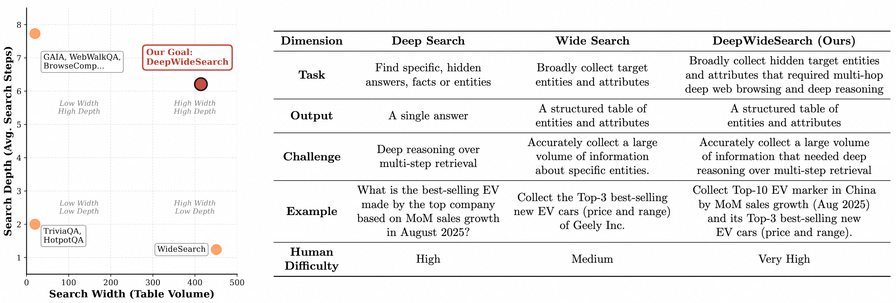
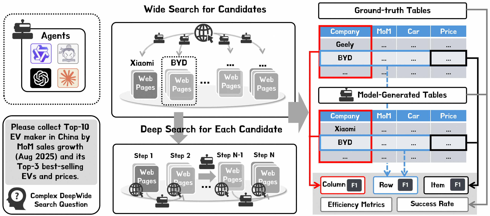
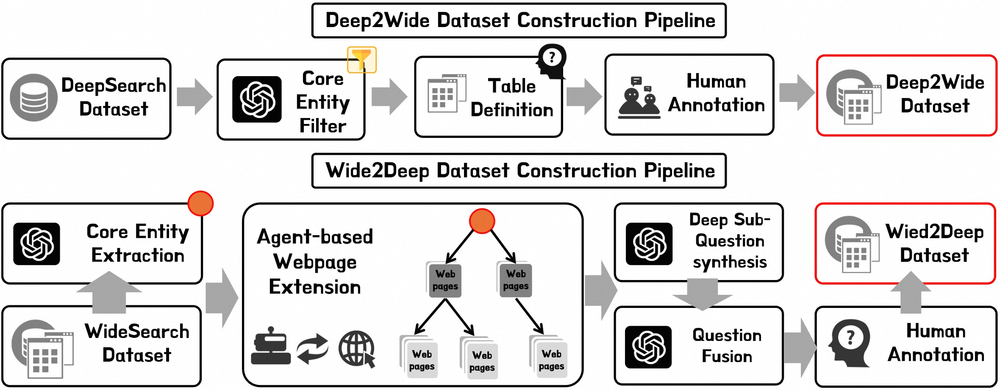
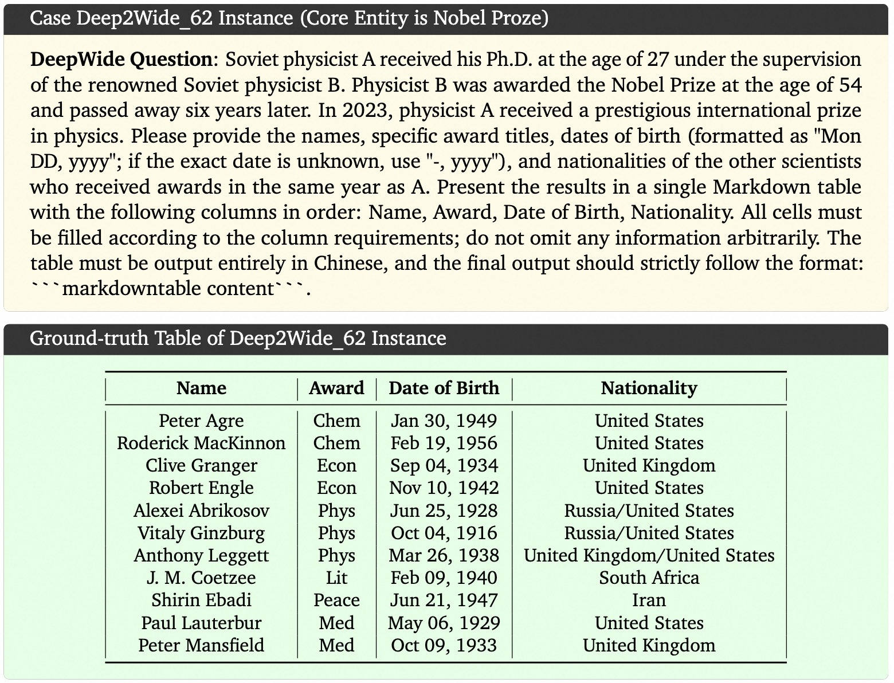
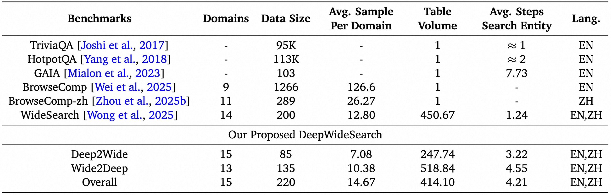
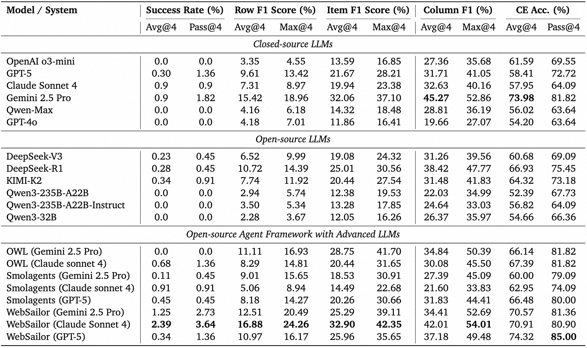
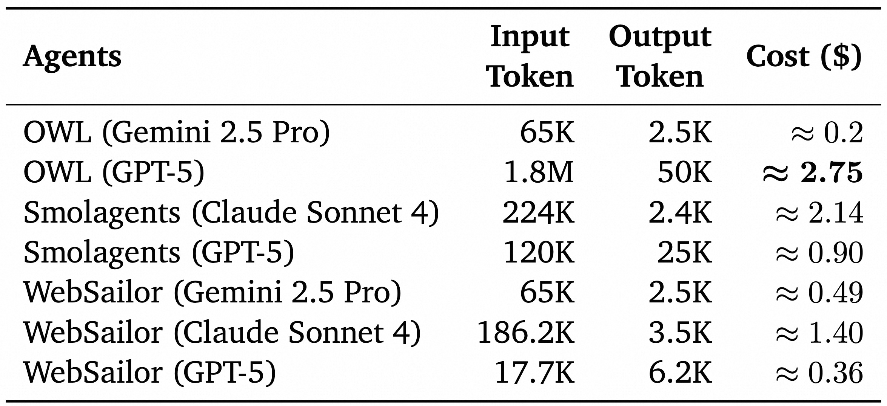

# DeepWideSearch: Evaluating Deep and Wide Agentic Information Seeking

[](LICENSE)
[](https://www.python.org/downloads/)
[](https://huggingface.co/datasets/AIDC-AI/DeepWideSearch)


<div align="center">

⭐ _**MarcoPolo Team**_ ⭐

[_**Alibaba International Digital Commerce**_](https://aidc-ai.com)

 [**Github**](https://github.com/AIDC-AI/Marco-DeepWideSearch-Agent/DeepWideSearch)  🤗  [**Hugging Face**](https://huggingface.co/datasets/AIDC-AI/DeepWideSearch) 📝  [**Paper**](../assets/DeepWideSearch.pdf) 🗂️  [**Data**](https://github.com/AIDC-AI/Marco-DeepWideSearch-Agent/data)

</div>

---

## 🎯 Motivation


Given two aspects of search depth and width, existing benchmarks fall into four categories:

- **Low width, high depth benchmarks** (e.g., GAIA, BrowseComp): focus on intricate deep reasoning over multi-hop retrieval for searching target answers
- **Low width, low depth benchmarks** (e.g., TriviaQA, HotpotQA): address simple fact-finding tasks
- **High width, low depth** (e.g., WideSearch and PaSa): emphasize broad information collection about specific questions
- **High width, high depth** (Our proposed DeepWideSearch): collect extensive information that required deep reasoning—a critical capability for real-world applications

As shown in the Table, our proposed DeepWideSearch exhibit significant challenging in searching scope and difficulty.




*DeepWideSearch: Bridging depth and width in information seeking*

**DeepWideSearch** is the first benchmark designed to evaluate LLM-based agents on **simultaneous deep reasoning over multi-hop retrieval and wide-scale information retrieval**—a critical capability for real-world tasks like market analysis and business developmen. The output of this task is a tabular. Rows are candidate answers of the questions and columns are attributes of each candidate that questions required to collect.


---

## 🔥 News
* [2025/10/] 🔥 We released the [paper](../assets/DeepWideSearch.pdf) and [dataset](https://huggingface.co/datasets/AIDC-AI/DeepWideSearch) of our challenging DeepWideSearch benchmarl.

---

## 📊 Benchmark Construction and Overview

### Dataset Conversion

To address the challenge of constructing DeepWideSearch instances from scratch, we propose two conversion methods.



**Deep2Wide Conversion**: We convert existing deep search benchmarks (BrowseComp, BrowseComp-zh) by expanding their scope. The process involves: (1) filtering 100 questions to identify suitable core entities, (2) designing structured table schemas, and (3) comprehensive human annotation to populate tables with verified information.

**Wide2Deep Conversion**: We transform WideSearch queries by introducing complexity in entity identification. The pipeline includes: (1) extracting core entities from 160 WideSearch questions, (2) generating complex sub-questions requiring additional web searches, (3) fusing deep sub-questions with original queries, and (4) human validation to ensure quality and complexity.

Both methods require significant human annotation effort (30-40 minutes per instance) to maintain high-quality standards and ensure the benchmark's rigor. Ouur proposed DeepWideSearch exhibit large search scope (table volume) and search depth (avg. steps for searching).

### Dataset Example and Statistics



---

## 🧪 Evaluation Metrics

We evaluate agent performance along three complementary axes: **Depth**, **Width**, and **Efficiency**.

### Depth Evaluation
Measures the capability of agents to correctly identify target entities through deep reasoning over multi-hop retrieval:

- **Column-F1**: F1 score over unique columns in the table, corresponding to core attributes that uniquely identify entities
- **Core Entity Accuracy (CE Acc.)**: Accuracy in identifying the core entity of questions

### Width Evaluation  
Measures how comprehensively and accurately agents retrieve all associated information units:

- **Success Rate**: Binary metric for exact match with human-annotated ground truth (all rows, columns, and values identical)
- **Row-level F1**: Precision, recall, and F1 scores at the entity level, capturing complete contextual information per entity
- **Item-level F1**: Finest-grained metric evaluating accuracy at individual cell level

### Evaluation Protocol
We conduct **4 independent runs** per question and report three statistics:
- **Avg@4**: Mean performance across all four runs
- **Max@4**: Best performance observed across the four runs  
- **Pass@4**: Proportion of questions solved successfully in at least one run (Success Rate only)

---

## 🚀 Quick Start

### 📁 Repository Structure

```
DeepWideSearch/
├── data/                   # Full benchmark (JSON format and CSV tables)
├── eval/                   # Evaluation codebase
├── scripts/                # Evaluation scripts
├── assets/                 
├── LICENSE
├── requirements.txt
└── README.md
```

---

### Install
```bash
git clone https://github.com/Marco-DeepWideSearch-Agent
cd DeepWideSearch
pip install -r requirements.txt
```

### Inference Your Agent to Obtain the results

The folder structure should be like this:
```
YOUR_MODEL_GENERATION_PATH
├── claude-sonnet-4
├── deepseek-r1
├── deepseek-v3
├── gemini-2.5-pro
├── gpt-4o
├── gpt-5
├── kimi-k2
├── o3-mini
├── owl_claude-sonnet-4
├── owl_gemini-2.5-pro
├── owl_gpt-5
├── qwen-max
├── qwen3-235b-a22b
├── qwen3-235b-a22b-instruct
├── qwen3-32b
├── smolagents_claude-sonnet-4
├── smolagents_gpt-5
├── smolgents_gemini-2.5-pro
├── websailor_claude4
├── websailor_gemini-2.5-pro
└── websailor_gpt-5
```

Each model sub-folder have following 4 files consisting the jsonl format data, for example:
```
YOUR_MODEL_GENERATION_PATH/deepseek-r1
├── iter1.jsonl
├── iter2.jsonl
├── iter3.jsonl
└── iter4.jsonl
```
These four files will be used to evaluate Avg@4, Max@4 and Pass@4 metrics.

For each jsonl file, its format is like
```jsonl
{"instance_id": "deep2wide_result_5_Lin Dan", "question": "There is a Chinese athlete who has achieved outstanding success in a racket sport. He was the first player in his discipline to successfully defend a major championship title and holds multiple world championship titles. His sport underwent significant rule changes in the early 21st century, and he became the first male singles Olympic champion in the post-rule-change era. Please help me compile and summarize this athlete’s competition records between 2010 and 2020 into a clear Markdown table, including the following columns: Date, Tournament Name, Level, Event, Result, and Match Details (including opponent, score, and win/loss outcome) ...", "rollout_id": 1, "prediction": "...", "messages": [{"role": "system", "content": "You are a Web Information Seeking Master. Your task is to thoroughly seek the internet for information and provide accurate answers to questions ..."}, {"role": "user", "content": "A conversation between User and Assistant ..."}, {"role": "assistant", "content": " ... "}]}
```
The jsonl file must consist of following keys:
* instance_id records the instance id
* question passed to the LLMs or Agents for solving
* prediction: the content of the last assistant response
* rollout_id: 1/2/3/4
* messages: the last turn of model generation will be used

### Evaluate Your Agent

```bash
#!/bin/bash

THREAD_NUM=4
models=("o3-mini" "claude-sonnet-4" "gemini-2.5-pro" "qwen-max" "deepseek-r1" "deepseek-v3" "kimi-k2" "qwen3-235b-a22b" "qwen3-235b-a22b-instruct" "qwen3-32b" "gpt-4o" "owl_claude-sonnet-4" "owl_gemini-2.5-pro" "owl_gemini-2.5-pro" "smolagents_claude-sonnet-4" "smolgents_gemini-2.5-pro" "smolagents_gpt-5" "websailor_gpt-5" "websailor_claude4" "websailor_gemini-2.5-pro")
for model in "${models[@]}"
do
    echo "============================"
    echo "evaluate $model begin"
    echo "============================"
    ./scripts/eval.sh $model $THREAD_NUM
done
```

---

## 📈 Key Findings


Base LLMs (even GPT-5, Claude Sonnet 4) score **< 1% Success Rate**. Best agent (**WebSailor + Claude Sonnet 4**) achieves only **2.39% Avg@4 Success Rate**.



Solving deep and wide search questions leads to huge inference cost. For example, OWL (GPT-5) requires over 2.75\$ for each question, even most questions are not solved.
Besides, due to unstable network conditions and tool call errors, agents often require multiple retry attempts to complete tasks such as search, significantly increasing computational overhead—for instance, OWL (GPT-5) incurs
an average cost exceeding $6.8 under retry conditions.  

---

## 🤝 Contributing

This project builds upon the great open-source implementation of [WideSearch](https://github.com/ByteDance-Seed/WideSearch) by ByteDance. We sincerely thank the ByteDance-Seed team for their pioneering work and for releasing WideSearch under the MIT open-source license. Our data construction pipeline, evaluation metrics, and codebase are heavily inspired by their framework. We acknowledge their contribution as a foundational component of DeepWideSearch.
We welcome:
- New test cases (especially from real industrial scenarios)
- Improved evaluation metrics
- Agent implementations & baselines

Please open an issue/PR or contact us ([Tian Lan](https://github.com/gmftbyGMFTBY) and [Longyue Wang](https://www.longyuewang.com/)).

---

## 🛡️ License

This project is licensed under the **Apache-2.0 License**

---

