# HSCodeComp: A Realistic and Expert-Level Benchmark for Deep Search Agents in Hierarchical Rule Application

[](https://opensource.org/licenses/Apache-2.0)
[](https://www.python.org/downloads/)
[](https://huggingface.co/datasets/AIDC-AI/HSCodeComp)
[](https://arxiv.org/abs/2510.19631)

<div align="center">

⭐ _**MarcoPolo Team**_ ⭐

[_**Alibaba International Digital Commerce**_](https://aidc-ai.com)

 [**Github**](https://github.com/AIDC-AI/Marco-DeepWideSearch-Agent/HSCodeComp) 🤗  [**Hugging Face**](https://huggingface.co/datasets/AIDC-AI/HSCodeComp) 📝  [**Paper**](http://arxiv.org/abs/2510.19631) 🗂️  [**Data**](https://github.com/AIDC-AI/Marco-DeepWideSearch-Agent/HSCodeComp/data/test_data.jsonl)


</div>

---

## 📌 Overview


<div align="center">
  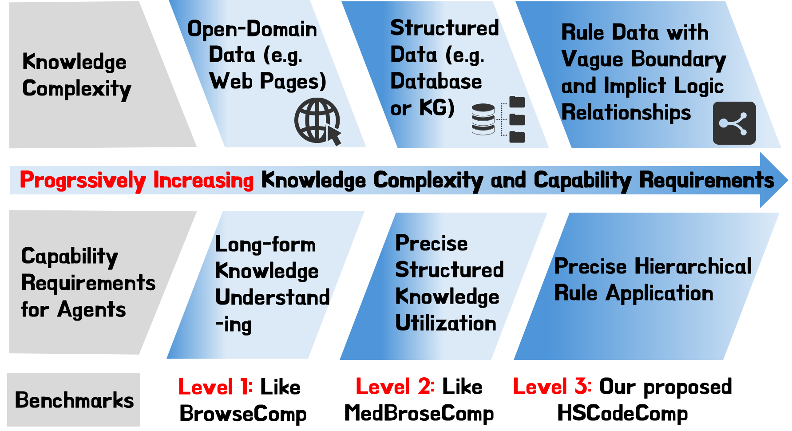
  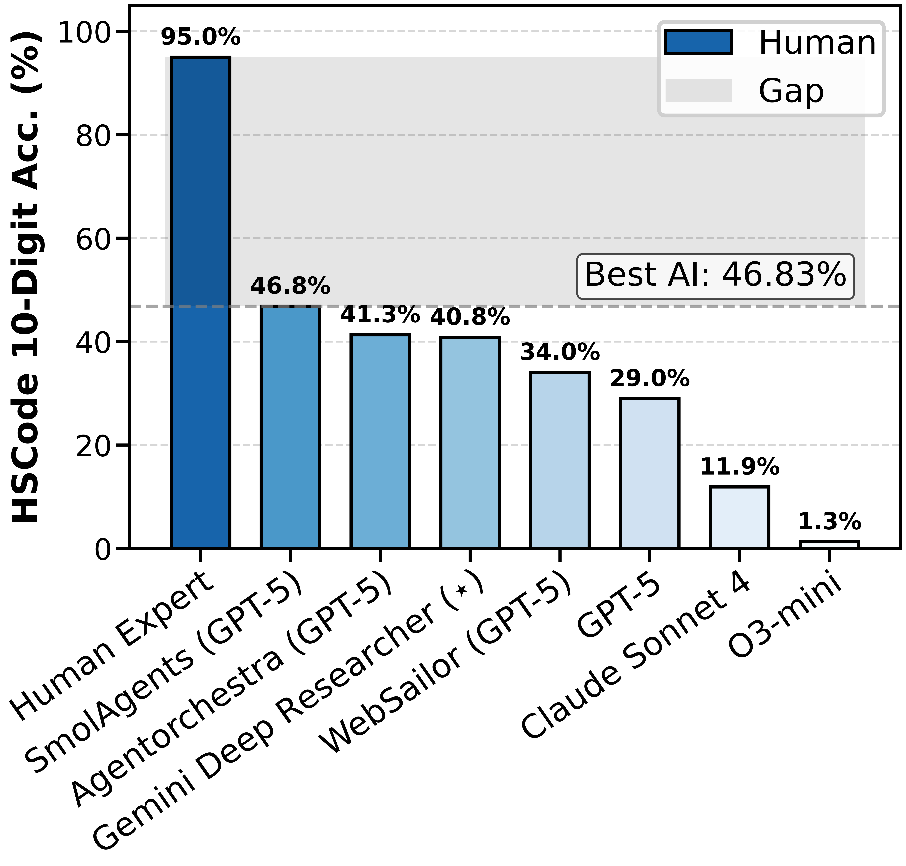
</div>

**HSCodeComp** is the first realistic, expert-level e-commerce benchmark designed to evaluate **deep search agents** on their ability to perform Level-3 knowledge—**hierarchical rule application**—a critical yet overlooked capability in current agent evaluation frameworks.

The task requires agents to predict the exact **10-digit Harmonized System Code (HSCode)** for products described with **noisy, real-world e-commerce domain**, by correctly applying complex, hierarcahical tariff rules (e.g., from eWTP and official customs rulings). These rules often contain **vague language** and **implicit logic**, making accurate classification highly challenging. Our evaluation reveals a stark performance gap:

* 🔹 **Best AI agent (SmolAgent + GPT-5 VLM): 46.8%**
* 🔹 **Human experts: 95.0%**

Besides, ablation study also reveals that **inference-time scaling fails to improve the performance**. These highlight that deep search with **hierarchical rule application** remains a major unsolved challenge for state-of-the-art AI agent systems. 

---

## 🔥 News
* [2025/10/] 🔥 We released the [paper](https://arxiv.org/abs/2510.19631) and [dataset](https://huggingface.co/datasets/AIDC-AI/HSCodeComp) of our challenging HSCodeComp dataset.

---

## 📋 Dataset

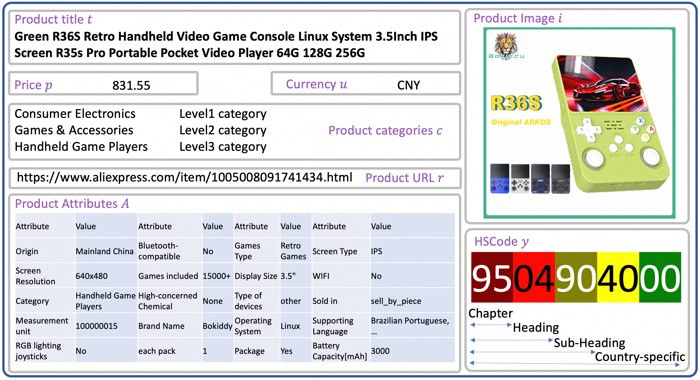
This figure reveals that the data format HSCodeComp dataset.

### Input

Each product $x \in \mathcal{X}$ contains rich information: $x = (t, A, c, i, p, u, r)$, where:
- **$t$**: Product title
- **$A = \{(k_j, v_j)\}_{j=1}^K$**: Set of $K$ product attributes (e.g., material, package size)
- **$c$**: Product categories defined by the e-commerce platform
- **$p$**: Price
- **$u$**: Currency

### Knowledge: Hierarchical Rules
The task requires agents to effectively utilize three types of e-commerce domain knowledge:
1. **Hierarchical tariff rules** from official classification systems (e.g., eWTP) with complex implicit logic and vague linguistic constraints.
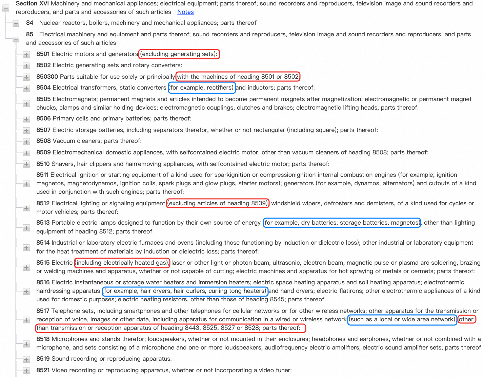
2. **Human-written decision rules** that specify how to correctly apply tariff rules
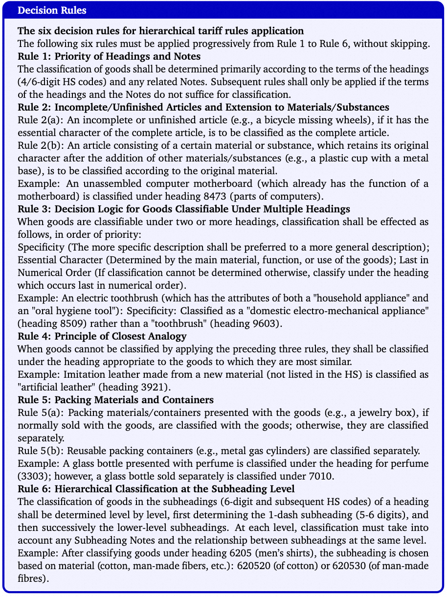
3. **Official customs rulings databases** (e.g., U.S. CROSS) containing historical HSCode classification decisions
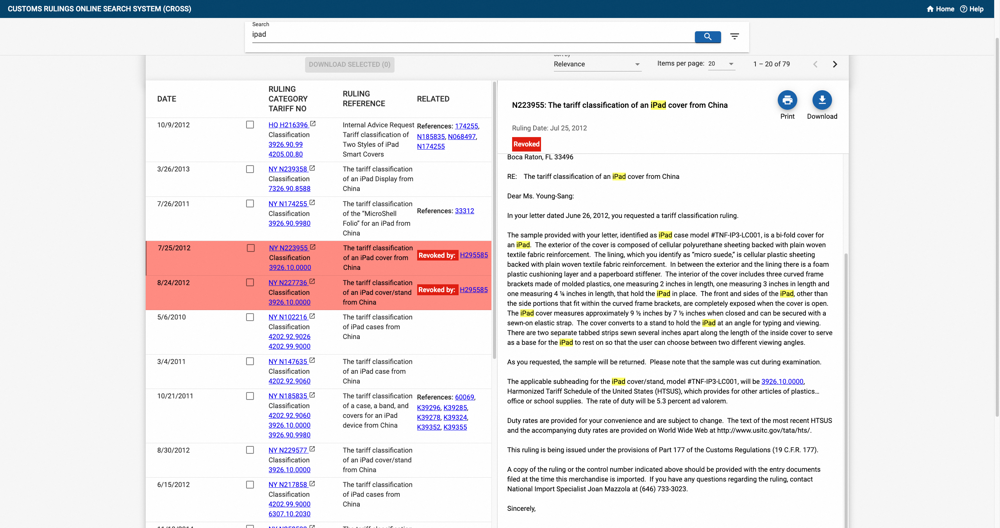

### Output

The HSCode $y \in \mathcal{Y}$ is a single **10-digit numeric string** $\mathcal{Y} \subseteq \{0,1,\ldots,9\}^{10}$. The HSCode structure is hierarchical:
- **First 2 digits**: HS chapter
- **First 4 digits**: HS heading  
- **First 6 digits**: HS sub-heading
- **Last 4 digits (7-10)**: Country-specific codes

The 10-digit HSCode must follow a valid path in the official HS taxonomy. Please refer to [our paper](https://arxiv.org/abs/2510.19631) for more details about these data.

### Dataset Collection and Statistic

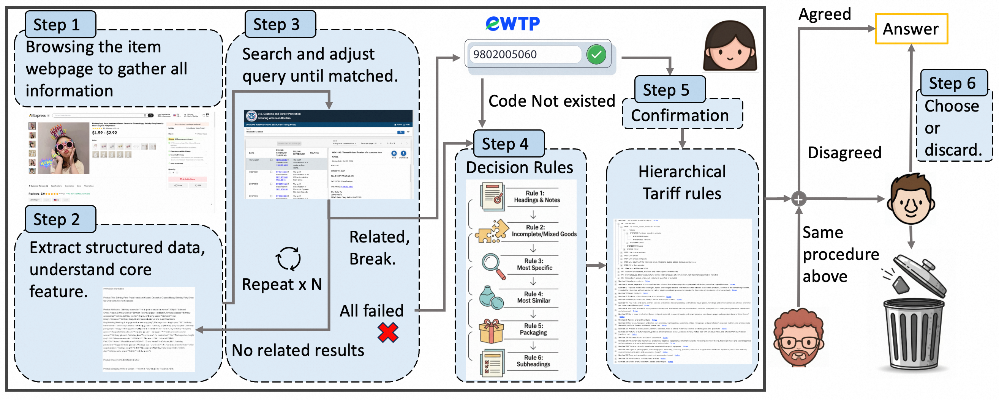
We engage several domain experts in HSCode prediction, and conduct a well-designed 6 steps pipeline to construct dataset. The important details of our proposed HSCodeComp is provided in following table.

| Metric | Value |
|--------|-------|
| **Total Products** | 632 expert-annotated entries |
| **HS Chapters** | 27 chapters |
| **First-level Categories** | 32 categories |
| **Data Source** | Large-scale e-commerce platforms |
| **Validation** | Multiple domain experts |
| **Inter-annotator Agreement** | >98% |
| **Models Tested** | 14 foundation models, 6 open-source agents, 3 closed-source systems |
| **Knowledge Level** | Level 3: Hierarchical rule application |


---

## ⚙️ Quick Start

### 📁 Repository Structure

```bash
HSCodeComp/
├── data/
│   └── test_data.csv              # Product descriptions, attributes and ground-truth HSCodes
├── eval/
│   └── test_llm.py                # Evaluation script for model predictions
├── LICENSE
└── README.md
```

### 🛠️ Environment Setup

```bash

# Create and activate a virtual environment (optional but recommended)
python -m venv hscodcomp_env
source hscodcomp_env/bin/activate  # Linux/macOS
# hscodcomp_env\Scripts\activate  # Windows

# Install dependencies (e.g., pandas, etc.)
pip install pandas,openai,tqdm,threading,dotenv

# set openai keys and base urls in HSCodeComp/.env
```

### 🚀 Run Evaluation

```bash
# Set models_to_test = ["gpt-4o"] in eval/test_llm.py
python eval/test_llm.py
```

The script reports **exact-match accuracy** at **2-digit, 4-digit, 6-digit, 8-digit, and 10-digit** levels.

---

## 📊 Benchmark Performance

### Complete Evaluation on HSCodeComp
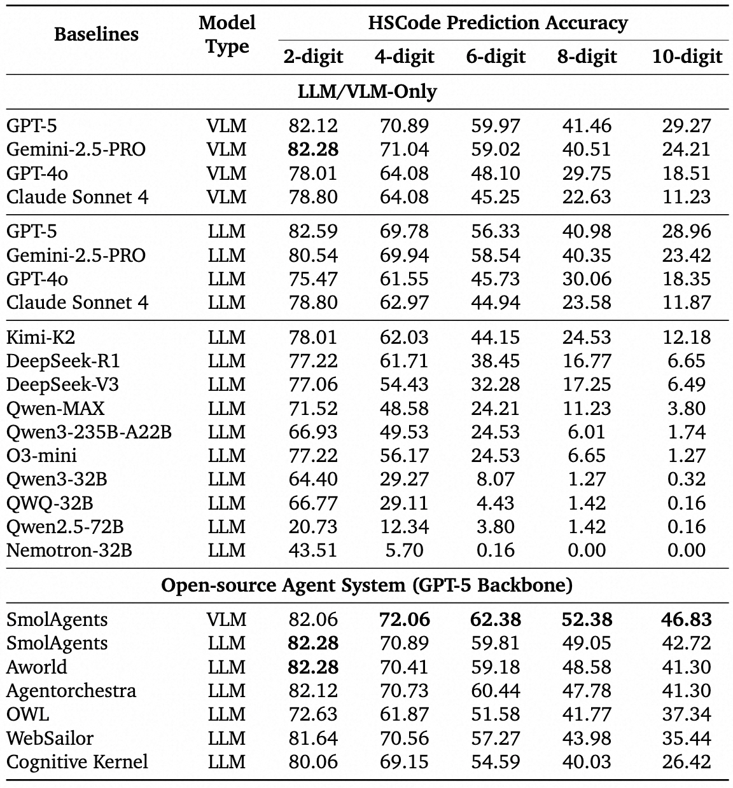

The top-performming baseline SmolAgent (GPT-5 with vision capability) achieves the best performance, while it sill largely lag behind human expert performance.

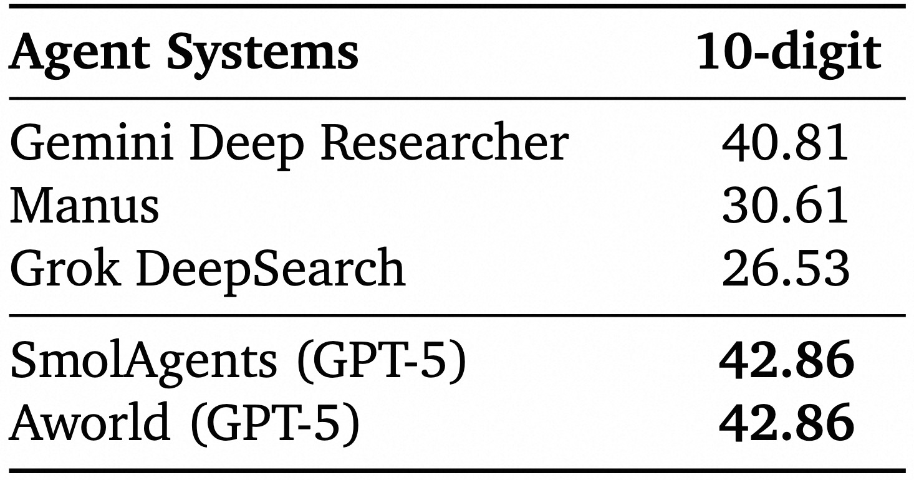

Closed-source agent systems still largely underperform domain expert and open-source agent systems with GPT-5 backbone model.

### Current Agents Fail to Leverage Hierarchical Decision Rules

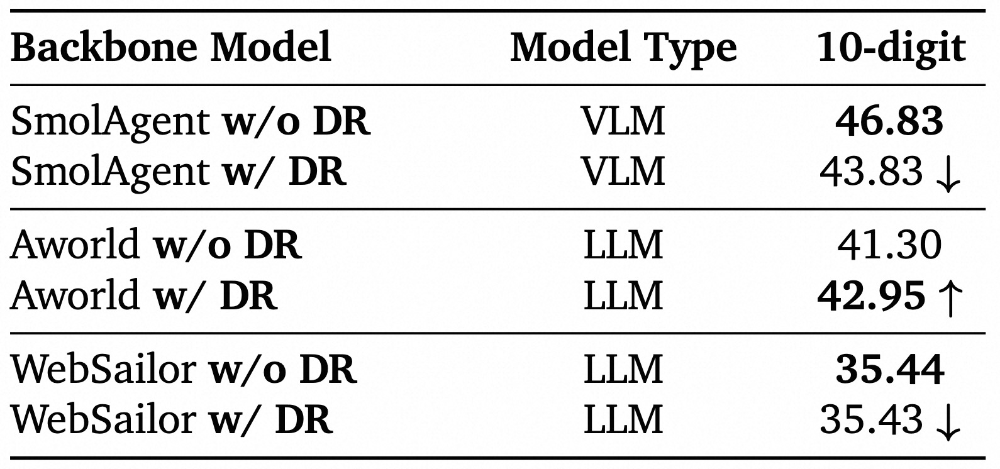

Performance degrades when human decision rules are included in the system prompt.


### More Thinking Leads to Worse Performance
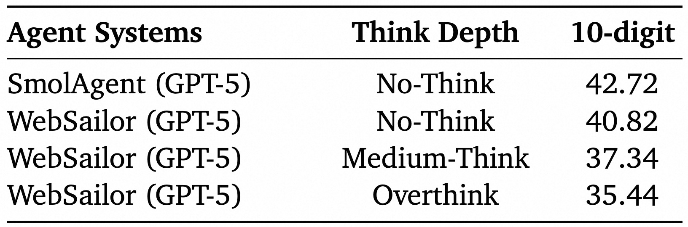

* More thinking leads to more errors and hallucinations in this highly domain-specific HSCode prediction task.
* When accurate information is available, through calling tools, prioritizing tool utilization over reasoning yields better results.

### Test-time Scaling Fails to Improve Performance
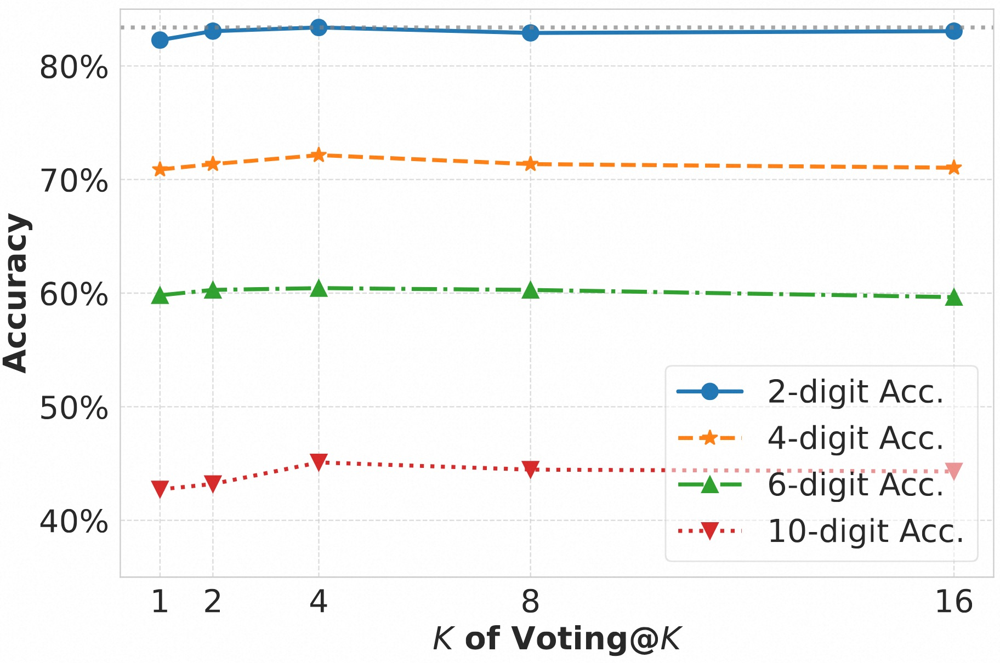

Two kinds of inference-time scaling strategy (majority voting and self-reflection) fails to effectively improve the performance.

> For complete experimental results, please refer to [our paper](https://arxiv.org/abs/2510.19631).

---

## 🤝 Acknowledgements

We thank the human experts who meticulously annotated and validated the HSCodes. Their domain knowledge is the foundation of this benchmark’s quality and realism.

---

## 🛡️ License

This project is licensed under the **Apache-2.0 License**

---

## ⚠️ DISCLAIMER
Our datasets are constructed using publicly accessible product data sources. Although we remove the product image and url in the HSCodeComp, we still cannot guarantee that our datasets are completely free of copyright issues or improper content. If you believe anything infringes on your rights or generates improper content, please contact us ([Tian Lan](https://github.com/gmftbyGMFTBY) and [Longyue Wang](https://www.longyuewang.com/)), and we will promptly address the matter.

---
