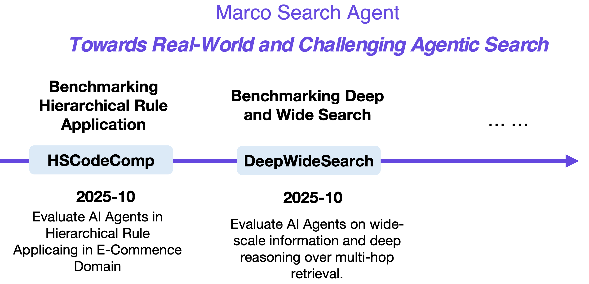

<div align="center">
  
</div>


# Marco-DeepWideSearch-Agent

[]()
[](https://opensource.org/licenses/Apache-2.0)
[](https://www.python.org/downloads/)


 

<div align="center">

⭐ _**MarcoPolo Team**_ ⭐

[_**Alibaba International Digital Commerce**_](https://aidc-ai.com)

 [**Github**](https://github.com/AIDC-AI/Marco-DeepWideSearch-Agent) 📝  [**HSCodeComp Paper**](assets/HSCodeComp.pdf) 📝  [**DeepWideSearch Paper**](assets/DeepWideSearch.pdf) 🤗  [**HSCodeComp Dataset**](https://huggingface.co/datasets/AIDC-AI/HSCodeComp) 🤗  [**DeepWideSearch Dataset**](https://huggingface.co/datasets/AIDC-AI/DeepWideSearch)

</div>


🎯 Marco-DeepWideSearch-Agent introduces two challenging agent benchmarks that expose critical gaps in current AI systems across two fundamental dimensions:

1. **HSCodeComp** ([`HSCodeComp`](HSCodeComp/README.md)): Evaluates **hierarchical rule application** in E-Commerce—*"What is the correct 10-digit HSCode for this silicone medical bracelet?"*. This benchmark tests the ability to apply complex, ambiguous rules embedded with hierarchical decision logic (e.g., tariff, legal, medical manuals) in domain-specific applications.

2. **DeepWideSearch** ([`DeepWideSearch`](DeepWideSearch/README.md)): Evaluates **deep-and-wide information seeking**—*"List all second-tier suppliers of Apple's AirPods, with contact info, location, and certification status."* This benchmark requires agents to simultaneously discover a large volume of candidates through wide-scale exploration and perform deep reasoning over multi-hop retrieval for each candidate.

These applications reveal fundamental limitations between current AI agents and human experts in critical yet underexplored dimensions of real-world applications.

⚠️ **Limitations**: We acknowledge that the current benchmarks primarily expose fundamental limitations in existing agent systems and their performance still falls short of human-level capabilities in these domains. This is not a one-time effort, and we remain committed to continuous optimization and ongoing improvement of both the benchmarks and the underlying agent architectures.


## 🔥 News
* [2025-10] 🔥 We released Marco-DeepWideSearch-Agent. This initial release includes two challenging benchmarks for cutting-edge agent systems——DeepWideSearch and HSCodeComp benchmarks.

<div align="center">
  
</div>

---

## 📦 Included Benchmarks

### 📑 [**HSCodeComp**](HSCodeComp/README.md)

*Evaluating Advanced Agent Systems on Hierarchical Rule Application in E-Commerce Domain*

- **Task**: Predict 10-digit Harmonized System (HS) Code from noisy product listings using official tariff rules.
- **Size**: 632 expert-annotated products
- **Domains**: 27 HS chapters, 32 e-commerce categories
- **Key Challenge**: Hierarchical rules contain **vague language** and **implicit decision logic**.
- **Human Performance**: **95.0%** (10-digit accuracy)
- **Best AI (SmolAgent + GPT-5 VLM)**: **46.8%**

> 💡 *Reveals that even top-performming agents fail at complex hierarchical rule application—a core skill in numerous important vertical domains, like law, customs, and E-Commernce.*

---

### 🌐 [**DeepWideSearch**](HSCodeComp/README.md)

*Evaluating Advanced Agent Systems on Deep-and-Wide Agentic Information Seeking*

- **Task**: Answer complex queries by producing **structured tables** (entities × attributes).
- **Size**: 220 multi-hop, multi-attribute questions (English & Chinese)
- **Avg. Output**: 414 information units per answer
- **Avg. Reasoning Depth**: 4.21 steps
- **Best AI (WebSailor + Claude Sonnet 4)**: **2.39% Success Rate**

> 💡 *Shows that advanced AI agents achieve only nearly 2% success rate with huge inference cost.*

---

## ⚡️ Released Resources

| Dataset | Huggingface | GitHub |
| ------- | ----------- | ------ | 
| HSCodeComp | [🤗 AIDC-AI/HSCodeComp](https://huggingface.co/datasets/AIDC-AI/HSCodeComp) | [](HSCodeComp/data/test_data.jsonl) |
| DeepWideSearch | [🤗 AIDC-AI/DeepWideSearch](https://huggingface.co/datasets/AIDC-AI/DeepWideSearch) | [](DeepWideSearch/data/) |

---

## 🚀 Quick Start

### Repository Structure

```
Marco-DeepWideSearch-Agent/
├── HSCodeComp/
│   ├── data/
│   ├── assets/
│   ├── eval/
│   ├── LICENSE
│   ├── NOTICE
│   └── README.md
├── DeepWideSearch/
│   ├── data/
│   ├── assets/
│   ├── eval/
│   ├── scripts/
│   ├── LICENSE
│   ├── NOTICE
│   ├── requirements.txt
│   └── README.md
├── assets
├── LICENSE
└── README.md
```

Please refer to [HSCodeComp](HSCodeComp/README.md) and [DeepWideSearch](DeepWideSearch/README.md) README files for more details about installation and usage.

### Evaluate Your Agent
Please refer to README in these two projects.
- For **HSCodeComp**: Use [`HSCodeComp/eval/test_llm.py`](HSCodeComp/eval/test_llm.py) to score 10-digit HSCode predictions.
- For **DeepWideSearch**: Use [`DeepWideSearch/scripts/batch_eval.sh`](DeepWideSearch/scripts/batch_eval.sh).

---

## 👨🏻‍💻 Acknowledgements

Main contributors are from MarcoPolo Team, AI Business, Alibaba International Digital Commerce. You could contact us via [Tian Lan](https://github.com/gmftbyGMFTBY) and [Longyue Wang](https://www.longyuewang.com/).
- **HSCodeComp** thanks human tariff experts for meticulous annotation (hourly wage: >$34/hr).
- **DeepWideSearch** builds upon the open-source [WideSearch](https://github.com/ByteDance-Seed/WideSearch) framework by ByteDance-Seed. We gratefully acknowledge their pioneering work and MIT-licensed codebase.

---

## 🛡️ License

This project is licensed under the **Apache-2.0 License**

## ⚠️ DISCLAIMER
Our datasets are constructed using publicly accessible data sources. For instance, HSCodeComp utilizes product data from real e-commerce platforms, while DeepWideSearch is built upon [BrowseComp](https://openai.com/index/browsecomp/), [BrowseComp-ZH](https://arxiv.org/abs/2504.19314), and [WideSearch](https://github.com/ByteDance-Seed/WideSearch) datasets. Due to the complexity of these tasks and the diverse nature of the underlying data, we cannot guarantee that our datasets are completely free of copyright issues or improper content. If you believe anything infringes on your rights or generates improper content, please contact us, and we will promptly address the matter.